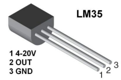
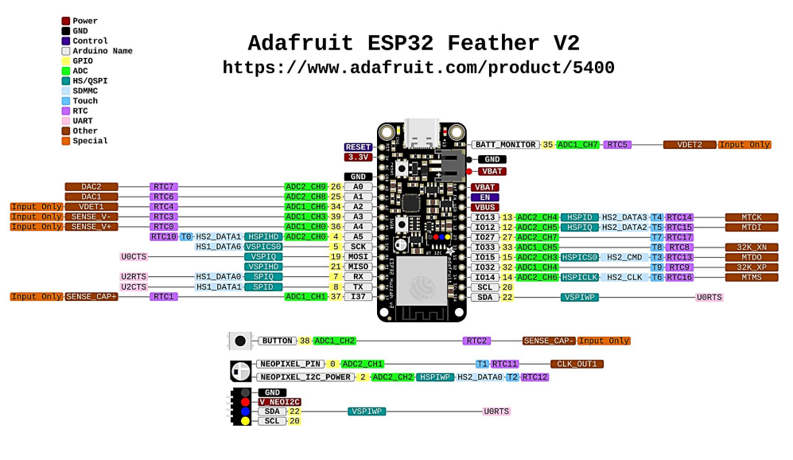
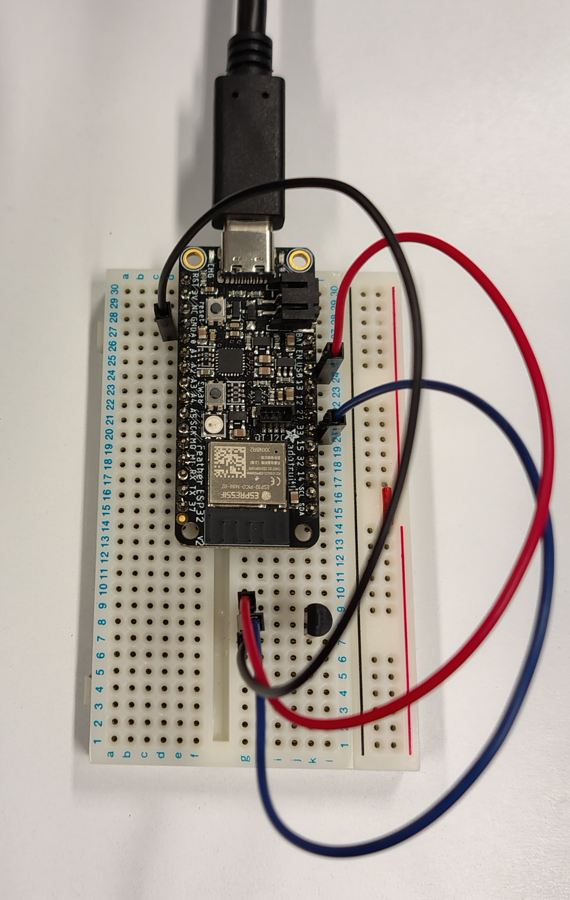
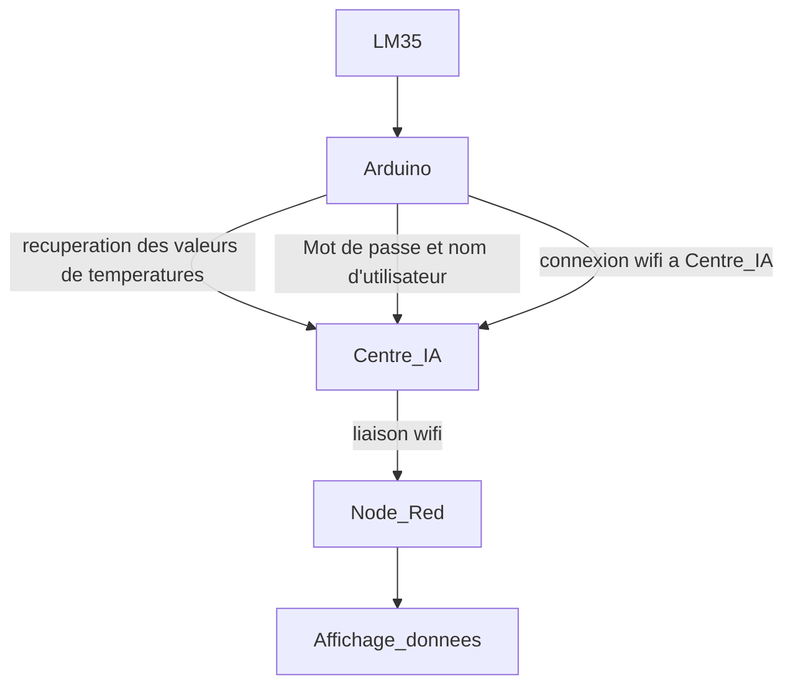
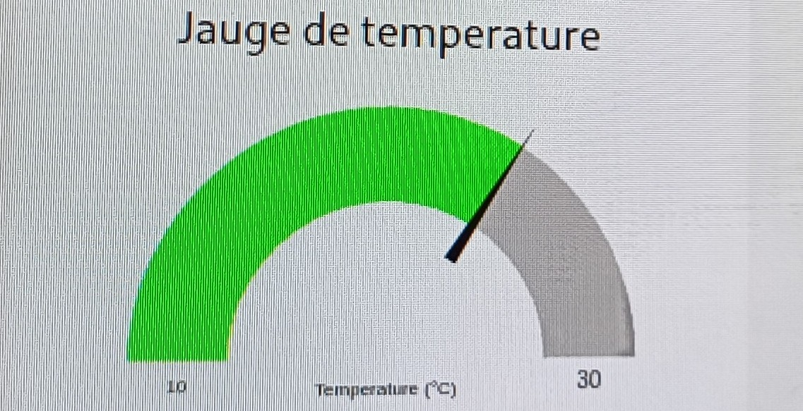
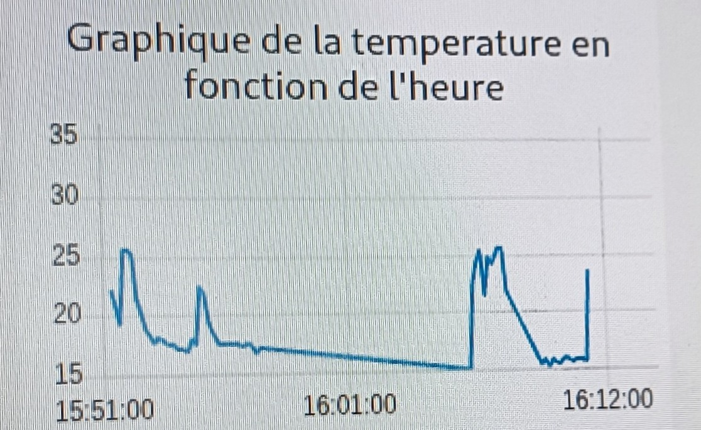

# ${\color{red}Projet \space de \space système \space de \space surveillance \space de \space température}$ 

# 📑 ${\color{red}Sommaire}$

- [Introduction](#Introduction)
- [Acquisition des données](#Acquisition)
- [Transmission des données](#Transmission)
  - [Configuration des blocs](#Configuration)
  - [Chemin d'accès](#Chemin)
- [Annexes](#Annexes)
  - [Annexe 1](#Annexe-1) 
  - [Annexe 2](#Annexe-2)
  - [Annexe 3](#Annexe-3)
  - [Annexe 4](#Annexe-4)
      - [Annexe 4.1](#Annexe-4-1)
      - [Annexe 4.2](#Annexe-4-2)
      - [Annexe 4.3](#Annexe-4-3)

<br></br>

<a id="Introduction"></a>
## ${\color{red}Introduction}$ 

L'objectif du projet est de concevoir un système de surveillance de température en utilisant un capteur LM35, un ESP32, un Raspberry Pi ainsi que le protocole MQTT. Les données seront transmises au Raspberry Pi via CentreIA.fr, stockées dans une base de données SQLite, et affichées en temps réel grâce à NodeRED. 


<h3 id="Acquisition">${\color{blue}I- \space Acquisition \space des \space données}$</h3>

#### <ins>Réalisation du montage</ins>  
Pour pouvoir obtenir la température, nous avons utilisé un capteur de température LM35 qui est connecté à la carte ESP32. Pour effectuer les branchements entre ces deux appareils, nous avons utilisé la documentation fournie lors des séances précédentes (voir image ci-dessous). 
 
<p align="center">
  
</p>

$$datasheet \space du \space LM35$$


 
$$datasheet \space de \space l'ESP32$$

Le LM35 est donc relié à l'ESP32 grâce à 3 fils. Un reliant la pin "Alimentation" du LM35 à la pin "VBUS" ou "USB" de la carte ESP32 qui délivre 5V, un deuxième reliant la pin OUT à la sortie analogique 33 et un troisième reliant les GND des deux appareils.

<p align="center">
  
</p>

$$montage \space LM35-ESP32$$

<h3 id="Transmission">${\color{blue}II- \space Transmission \space des \space données}$</h3>

<h4 id="Chemin"><ins><b>Chemin d'accès</b></ins></h4>

Une fois ce montage réalisé, il a été connecté à l'ordinateur dans lequel nous avons rédigé un code Arduino (voir en Annexe1 ou en fichier joint). Ce code permet de récupérer les valeurs de température mesurées avec le LM35 et de se connecter en wifi au poste fixe sur lequel se trouve Node Red. Dans le programme Arduino, nous avons fait en sorte qu'un mot de passe et un nom d'utilisateur soit rentré pour se connecter à CentreIA.
La liaison se fait comme suit : 



Pour démarrer et configurer le Raspberry et Node-Red nous avons suivi la démarche suivante : <br> 
<ins>code Raspberry :</ins><br> 
+ pour installer node red : 
``` sql
bash <(curl -sL https://github.com/node-red/linux-installers/releases/latest/download/update-nodejs-and-nodered-deb)
```
+ pour ouvrir node red :
```sql
node-red-pi --max-old-space-size=256
```
Pendant le chargement, un lien http://127.0.0.1:1880/ va apparaitre. Il faudra cliquer dessus pour ouvrir Node-Red dans le navigateur du Raspberry.  

+ installation de SQLite pour la base de données :
```sql
sudo apt install sqlite3
```
+ ouvrir la base de donnée :
```sql
sqlite3 data.db
```
+ créer une table de données :
```sql
CREATE TABLE mesures (id INTEGER PRIMARY KEY AUTOINCREMENT, ts datetime, temp real);
```
+ ouvrir le contenu de la table : 
```sql
select * from mesures;
```
Au début le tableau de données est vide. On va donc installer la librairie SQLite sur Node-Red : node-red-node-sqlite
<br>

Les données recueillies sont stockées en temps réelles dans la base de donnée. <br></br>
Lorsque l'on réouvre la table sur le raspberry, on obtient à présent le tableau ci-dessous : <br></br>
<p align="center">
  
</p>
<br></br>

Les données obtenues dans Node Red sont affichées dans son interface. Après avoir récupéré ces données, nous avons configuré l'interface utilisateur Node-Red. Cet interface doit afficher les valeurs de température dans un graphique. L'interface est construit à partir de 7 blocs : 
+ bloc de connexion
+ 2 blocs debug 
+ bloc jauge de température
+ bloc graphique
+ bloc SQLite (via installation librairie SQLite)
+ bloc fonction
<br> </br>
<p align="center">
  
</p>

$$Schéma \space Node-Red$$

<br></br> 

:warning: Pour ouvrir la page affichant le graphique et la jauge, on utilise le même lien que celui pour ouvrir Node-Red dans le Raspberry auquel on rajoute ui : http://127.0.0.1:1880/ui
Pour visualiser le rendu des différents paramétrages de température jauge/graphique, voir Annexe 4. 
<br></br>
 
<h4 id="Configuration"><ins><b>Configuration des blocs</b></ins></h4>

Chaque bloc a une configuration spécifique (voir les différentes photos pour paramétrer les blocs) : 

<ins> bloc de connexion :</ins> pour se connecter à CentreIA et collecter les données <br>

<p align="center">
  
</p>

Ensuite aller sur le crayon et compléter l'onglet security <br> 
+ nom d'utilisateur : user_iut <br>
+ mot de passe : IUT2026 <br>  

<p align="center">
  
</p>

<ins> bloc debug : </ins> configuration basique du bloc <br>

<ins> bloc jauge de température :</ins> voir la température mesurée en direct<br>
Cette jauge est paramétrée de manière à ce que trois couleurs soit affichées en fonction de la température mesurée : 
+ bleue pour T : 10 < T < 18 °C
+ vert pour T : 18 < T < 25 °C
+ rouge pour T : 25 < T < 30°C

<p align="center">
  
</p>

<p align="center">
  
</p>

<ins> bloc graphique :</ins> voir l'évolution de la température dans le temps<br>

<p align="center">
  
</p>
<p align="center">
  
</p>

<ins> bloc SQLite :</ins> faire la base de données
Pour obtenir l'emplacement de la database, il faut écrire dans la console Raspberry : 
ls puis pwd. <br> 

<p align="center">
  
</p>

<ins> bloc fonction :</ins> créer le tableau <br> 

<p align="center">
  
</p>
<br></br>

### ${\color{blue}III- \space Alerte \space et \space automatisation} $
#### <ins>**Configuration de la LED**</ins>
Une fois les blocs configurés, nous recevons les valeurs de température dans Node-Red. 
Ensuite, nous ajoutons une LED clignotante bleue (présente sur l'ESP32) qui nous indique lorsque la valeur de température mesurée est inférieure ou égale à 18°C et rouge lorsque la température est inférieure ou égale à 27°C.(Voir code Arduino LED en Annexe2 ou en fichier joint). Pour cela il a fallut installer la librairie "Adafruit DMA neopixel". On retrouve en Annexe 3 (ou en fichier joint) le code Arduino final avec le clignotement de la LED intégré.  <br> </br>

<p align="center">
  
</p>
<p align="center">
  
</p><br> </br>


#### <ins>**Configuration du message d'alerte**</ins>
Dans l'optique où l'on mesure une température grâce au LM35 sans être à côté du capteur, nous avons fait en sorte de recevoir un mail pour indiquer que la température mesurée est trop basse ou trop haute.

Nous avons donc, dans un second temps,  rajouté 4 blocs à ceux déjà existant : 
+ <ins> bloc fonction :</ins> définir le message à envoyer <br> 
<p align="center">
  
</p>
<br></br>

+ <ins> 2 blocs switch :</ins> choisir un seuil de détection (ici il y aura un switch pour un seuil de température froid et un pour le seuil chaud) <br> 

<p align="center">
  
</p>
<p align="center">
  
</p>

<p align="center">
  
</p>
<br> </br>

+ <ins> bloc mail :</ins>
Pour configurer le bloc mail, nous avons d'abord téléchargé une librairie sur Node-Red : node-red-node-email.
On sélectionne ensuite le bloc mail dans lequel on remplit les champs suivants : 
<p align="center">
  
</p>

Pour le mot de passe, on définit le mot de passe sur le compte gmail en allant sur : 
+ Sécurité
+ Activer la validation en 2 étapes
+ Mot de passe des applications 
+ Rentrer le nom de l'application 
+ "Créer" 
+ Rentrer le mot de passe afficher par gmail dans la partie password de Node-Red 
<br> </br>

Voici le message reçu par mail : <br></br>
<p align="center">
  
</p>
<br></br>

Pour avoir un historique des données, on les enregistre dans un fichier csv grâce à la commande suivante (sur Raspberry): 
``` sql
sqlite3 -header -csv data.db " select * from mesures;" > data_mesures1.csv
```
Cela permet de faciliter leur exploitation (voir fichier joint). 

# ${\color{red}Démonstration}$ 
La vidéo de démonstrtation se trouve dans le fichier : 1000014436.mp4

<h1 id="Annexes">${\color{red}Annexe}$</h1>
<h2 id="Annexe-1">${\color{blue}Annexe 1}$</h2>
### ${\color{blue}Code \space Arduino \space ESP32} $

```cpp 
#include <WiFi.h> // Enables the ESP32 to connect to the local network (via WiFi)
#include <PubSubClient.h> // Connect and publish to the MQTT broker
// WiFi
//const char* ssid = "Laura's Galaxy A41"; // Your personal network SSID
//const char* wifi_password = "123456789"; // Your personal network password
const char* ssid = "LoraChoco"; // Your personal network SSID
const char* wifi_password = "MRB3HBM0R28"; // Your personal network password
// MQTT
const char* mqtt_server = "centreia.fr"; // IP of the MQTT broker
const char* temperature_topic = "home/classroom/temperature";
const char* mqtt_username = "username"; // MQTT username
const char* mqtt_password = "password"; // MQTT password
const char* clientID = "client_cter_esp32_classroom"; // MQTT client ID
// Initialise the WiFi and MQTT Client objects
// Initialise the WiFi and MQTT Client objects
WiFiClient wifiClient;
// 1883 is the listener port for the Broker
PubSubClient client(mqtt_server, 1883, wifiClient); 
// Custom function to connet to the MQTT broker via WiFi
void connect_MQTT(){
// Connect to MQTT Broker
// client.connect returns a boolean value to let us know if the connection was successful.
// If the connection is failing, make sure you are using the correct MQTT Username and Password (Setup Earlier in the Instructable)
if (client.connect(clientID)) {
 Serial.println("Connected to MQTT Broker!");
}
else {
 Serial.println("Connection to MQTT Broker failed...");
}
}
void setup() {
Serial.begin(9600);
// Oublie de l'ancienne config Wifi
WiFi.disconnect(true);
delay(1000);
WiFi.mode(WIFI_STA); // mode station
// Connect to Wifi
Serial.print("Connecting to ");
Serial.println(ssid);
WiFi.begin(ssid, wifi_password);
// Wait until the connection has been confirmed before continuing
while (WiFi.status() != WL_CONNECTED) {
 delay(500);
 Serial.print(".");
}
// Debugging - Output the IP Address of the ESP32
Serial.println("WiFi connected");
Serial.print("IP address: ");
Serial.println(WiFi.localIP());
}
void loop() {
connect_MQTT();
Serial.setTimeout(2000);
int raw = analogRead(33);
Serial.print("raw : ");
Serial.println(raw);
float volts = (float)raw*3.3/4095; // il faut forcer volt a être un float sinon la division renvoie un int (donc 0 au lieu de 0.2)
Serial.print("volts : ");
Serial.println(volts);
float degres = volts/0.01;
Serial.print("degres : ");
Serial.println(degres);
// MQTT can only transmit strings
String temperature_string = String(degres);
// PUBLISH to the MQTT Broker (topic = Temperature, defined at the beginning)
if (client.publish(temperature_topic, temperature_string.c_str())) {
 Serial.println("Temperature sent!");
}
// client.publish will return a boolean value depending on whether it succeded or not.
// If the message failed to send, we will try again, as the connection may have broken.
else {
 Serial.println("Temperature failed to send. Reconnecting to MQTT Broker and trying again");
 client.connect(clientID, mqtt_username, mqtt_password);
 delay(10); // This delay ensures that client.publish doesn't clash with the client.connect call
 client.publish(temperature_topic, temperature_string.c_str());
}
client.disconnect(); // disconnect from the MQTT broker
delay(1000*10); // print new values every 10 seconds
}
```
<br><br> 
</br> 

<h2 id="Annexe-2">${\color{blue}Annexe 2}$</h2>
### ${\color{blue}Code \space Arduino \space LED} $ 

```cpp
void setup() {
  // No need to initialize the RGB LED
}

// the loop function runs over and over again forever
void loop() {
#ifdef RGB_BUILTIN
  digitalWrite(RGB_BUILTIN, HIGH);  // Turn the RGB LED white
  delay(1000);
  digitalWrite(RGB_BUILTIN, LOW);  // Turn the RGB LED off
  delay(1000);

  rgbLedWrite(RGB_BUILTIN, RGB_BRIGHTNESS, 0, 0);  // Red
  delay(1000);
  rgbLedWrite(RGB_BUILTIN, 0, RGB_BRIGHTNESS, 0);  // Green
  delay(1000);
  rgbLedWrite(RGB_BUILTIN, 0, 0, RGB_BRIGHTNESS);  // Blue
  delay(1000);
  rgbLedWrite(RGB_BUILTIN, 0, 0, 0);  // Off / black
  delay(1000);
#endif
}
```

<h2 id="Annexe-3">${\color{blue}Annexe 3}$</h2>
### ${\color{blue}Code \space final \space Arduino} $ 

```cpp 
#include <WiFi.h> // Enables the ESP32 to connect to the local network (via WiFi)
#include <PubSubClient.h> // Connect and publish to the MQTT broker
// WiFi
//const char* ssid = "Laura's Galaxy A41"; // Your personal network SSID
//const char* wifi_password = "123456789"; // Your personal network password
const char* ssid = "LoraChoco"; // Your personal network SSID
const char* wifi_password = "MRB3HBM0R28"; // Your personal network password
// MQTT
const char* mqtt_server = "centreia.fr"; // IP of the MQTT broker
const char* temperature_topic = "HugoLaura/temperature";
const char* mqtt_username = "user_iut"; // MQTT username
const char* mqtt_password = "IUT2026"; // MQTT password
const char* clientID = "client_cter_esp32_classroom"; // MQTT client ID
// Initialise the WiFi and MQTT Client objects
// Initialise the WiFi and MQTT Client objects
WiFiClient wifiClient;
// 1883 is the listener port for the Broker
PubSubClient client(mqtt_server, 1883, wifiClient); 
// Custom function to connet to the MQTT broker via WiFi
void connect_MQTT(){
// Connect to MQTT Broker
// client.connect returns a boolean value to let us know if the connection was successful.
// If the connection is failing, make sure you are using the correct MQTT Username and Password (Setup Earlier in the Instructable)
if (client.connect(clientID)) {
 Serial.println("Connected to MQTT Broker!");
}
else {
 Serial.println("Connection to MQTT Broker failed...");
}
}
void setup() {
Serial.begin(9600);
// Oublie de l'ancienne config Wifi
WiFi.disconnect(true);
delay(1000);
WiFi.mode(WIFI_STA); // mode station
// Connect to Wifi
Serial.print("Connecting to ");
Serial.println(ssid);
WiFi.begin(ssid, wifi_password);
// Wait until the connection has been confirmed before continuing
while (WiFi.status() != WL_CONNECTED) {
 delay(500);
 Serial.print(".");
}
// Debugging - Output the IP Address of the ESP32
Serial.println("WiFi connected");
Serial.print("IP address: ");
Serial.println(WiFi.localIP());
}
void loop() {
connect_MQTT();
Serial.setTimeout(2000);
int raw = analogRead(33);
Serial.print("raw : ");
Serial.println(raw);
float volts = (float)raw*5/4095; // il faut forcer volt a être un float sinon la division renvoie un int (donc 0 au lieu de 0.2)
Serial.print("volts : ");
Serial.println(volts);
float degres = volts/0.01;
Serial.print("degres : ");
Serial.println(degres);

#ifdef RGB_BUILTIN
  if (degres > 25) {
    rgbLedWrite(RGB_BUILTIN, RGB_BRIGHTNESS, 0, 0); // Rouge
    delay(500);
    digitalWrite(RGB_BUILTIN, LOW); // LED éteinte
    delay(500);
    rgbLedWrite(RGB_BUILTIN, RGB_BRIGHTNESS, 0, 0); // Rouge
    delay(500);
    digitalWrite(RGB_BUILTIN, LOW); // LED éteinte
  } 
  else if (degres < 18) {
    rgbLedWrite(RGB_BUILTIN, 0, 0, RGB_BRIGHTNESS); // Bleu
    delay(500);
    digitalWrite(RGB_BUILTIN, LOW); // LED éteinte
    delay(500);
    rgbLedWrite(RGB_BUILTIN, 0, 0, RGB_BRIGHTNESS); // Bleu
    delay(500);
    digitalWrite(RGB_BUILTIN, LOW); // LED éteinte
  } 
  else {
    digitalWrite(RGB_BUILTIN, LOW); // LED éteinte
  }
#endif


// MQTT can only transmit strings
String temperature_string = String(degres);
// PUBLISH to the MQTT Broker (topic = Temperature, defined at the beginning)
if (client.publish(temperature_topic, temperature_string.c_str())) {
 Serial.println("Temperature sent!");
}
// client.publish will return a boolean value depending on whether it succeded or not.
// If the message failed to send, we will try again, as the connection may have broken.
else {
 Serial.println("Temperature failed to send. Reconnecting to MQTT Broker and trying again");
 client.connect(clientID, mqtt_username, mqtt_password);
 delay(10); // This delay ensures that client.publish doesn't clash with the client.connect call
 client.publish(temperature_topic, temperature_string.c_str());
}
client.disconnect(); // disconnect from the MQTT broker
delay(1000*10); // print new values every 10 seconds 
}
```
<h2 id="Annexe-4">${\color{blue}Annexe 4}$</h2>
<h3 id="Annexe-4-1">${\color{blue}Annexe \space 4.1}$</h3>
<p align="center">
  
</p>
<br></br>

<h3 id="Annexe-4-2">${\color{blue}Annexe \space 4.2}$</h3>
<p align="center">
  
</p>
<br></br>

<h3 id="Annexe-4-3">${\color{blue}Annexe \space 4.3}$</h3>
<p align="center">
  
</p>
<br></br>
